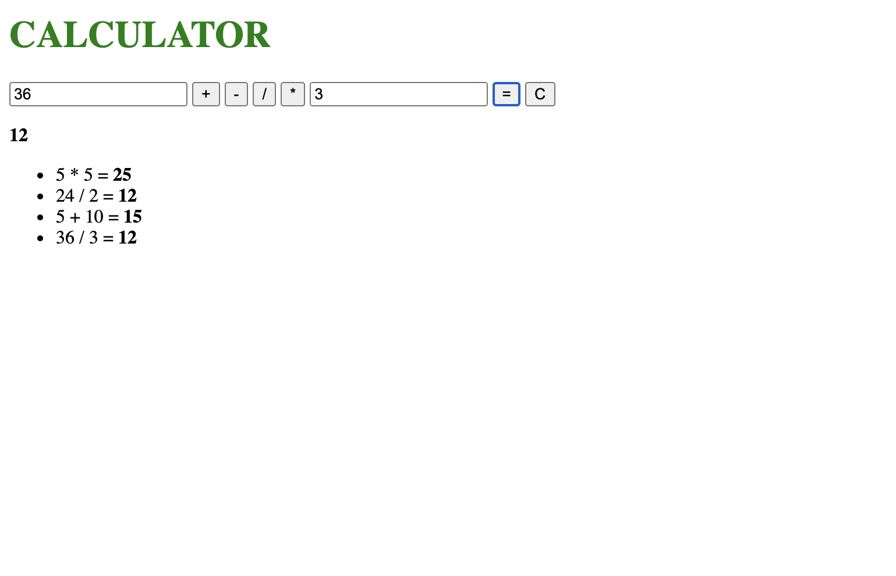

# Server Side Calculator

This is a calculator that handles the addition, subtraction, multiplication, and division of two numbers

## Description

Duration: 10 hours

This application takes in the user input of two numbers and a mathmatical operator and uses those inputs to calculate an answer. The catch is the calculation has to be stored and executed on the server side and sent to the client side. I was able to accomplish this by creating an object containing the user input and send it to the server via ajax POST route. From there the object's values are interpreted and a calculation is executed based on those values. The result of this calculation is then added to the object, Now that the object has an answer it is sent back to the client side to be appended to the DOM

### Screen Shot

### Prerequisites

Node.js

### Installation

1. download node
2. open files in editor of your choice
3. run npm install in terminal
4. run npm start in terminal

### Usage

input two numbers to be calculated
select mathmatical operator 
click '=' button to get calculation
inputs don't clear automatically and must be cleared with button

### Built With

Visual Studio Code

## Acknowledgement
Thank you to my instructors who have gotten me to this point, and the members of my group for helping me along the way!

## Support
If you have suggestions or issues, please email me at preston.thomas355@gmail.com
